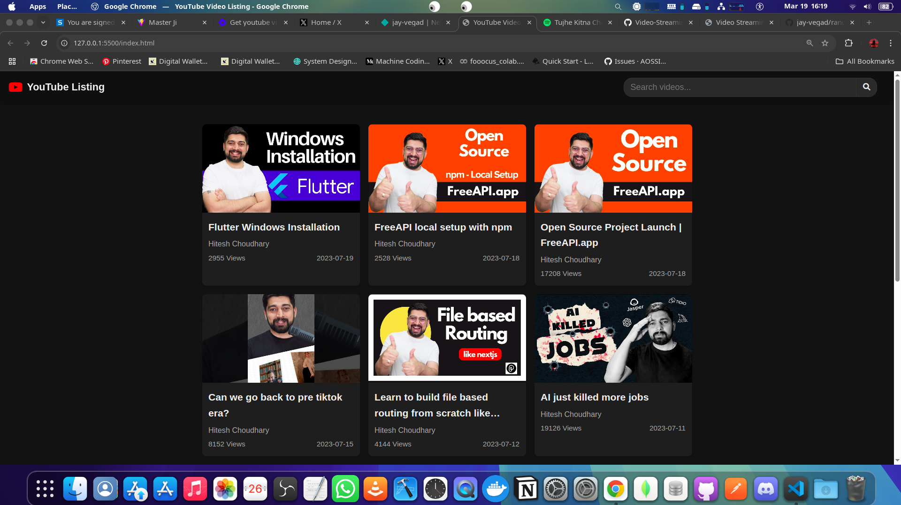
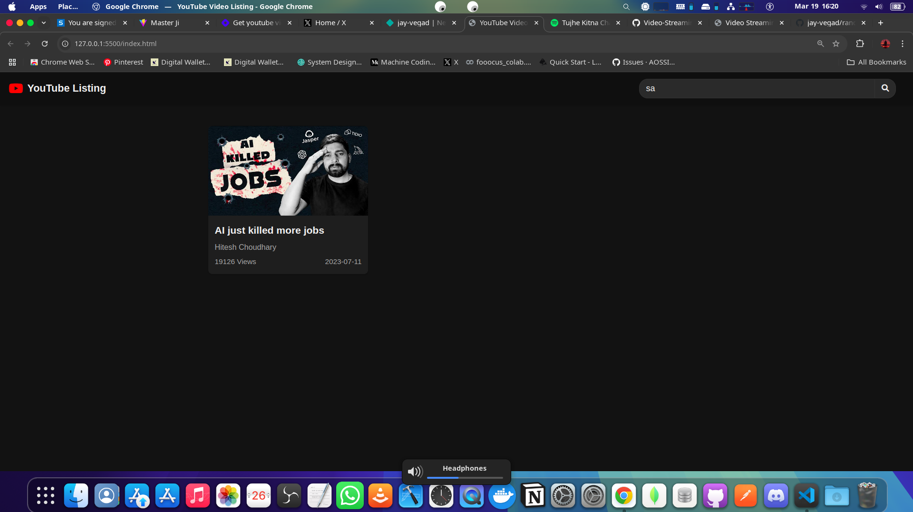

# YouTube Video Listing

A sleek, responsive web application that displays YouTube videos in a grid layout with real-time search functionality. This project uses the freeapi.app YouTube videos API to fetch and display video data with a modern, dark-themed interface.

## Deployed Link:- https://mini-youtube-123.netlify.app/

- Main Ui


- Search Functionality



### HTML Structure

The project uses a simple and clean HTML structure with:
- A header containing the YouTube logo and search functionality
- A main container for video display
- Error and loading state handlers

### CSS Features

- Custom dark theme with carefully selected colors
- CSS variables for easy theme customization
- Responsive grid layout using CSS Grid
- Smooth hover animations
- Mobile-first approach with media queries

### JavaScript Functionality

- Asynchronous API calls using Fetch API
- Video data mapping and formatting
- Real-time search with debounce functionality
- Error handling and loading states
- Time and view count formatting

## API Integration

This project uses the free YouTube API from freeapi.app:
```
https://api.freeapi.app/api/v1/public/youtube/videos
```

## Getting Started

1. Clone the repository:
   ```
   git clone https://github.com/yourusername/youtube-video-listing.git
   ```

2. Open the `index.html` file in your browser or use a local server:


3. No API key is required as the project uses a free public API.
